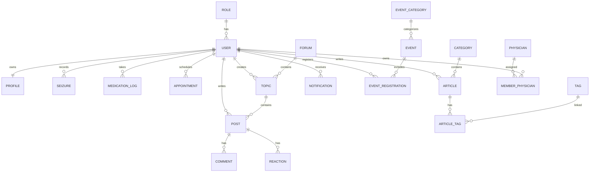

# Entity Relationship Diagram

```mermaid
erDiagram

ROLE ||--o{ USER : has

USER ||--|| PROFILE : owns

USER ||--o{ SEIZURE : records

USER ||--o{ MEDICATION_LOG : takes

USER ||--o{ APPOINTMENT : schedules

USER ||--o{ ARTICLE : writes

USER ||--o{ TOPIC : creates

USER ||--o{ POST : writes

USER ||--o{ NOTIFICATION : receives

USER ||--o{ EVENT_REGISTRATION : registers

CATEGORY ||--o{ ARTICLE : contains

ARTICLE ||--o{ ARTICLE_TAG : has

TAG ||--o{ ARTICLE_TAG : linked

FORUM ||--o{ TOPIC : contains

TOPIC ||--o{ POST : contains

POST ||--o{ COMMENT : has

POST ||--o{ REACTION : has

EVENT_CATEGORY ||--o{ EVENT : categorizes

EVENT ||--o{ EVENT_REGISTRATION : includes

PHYSICIAN ||--o{ MEMBER_PHYSICIAN : assigned

USER ||--o{ MEMBER_PHYSICIAN : owns
```

